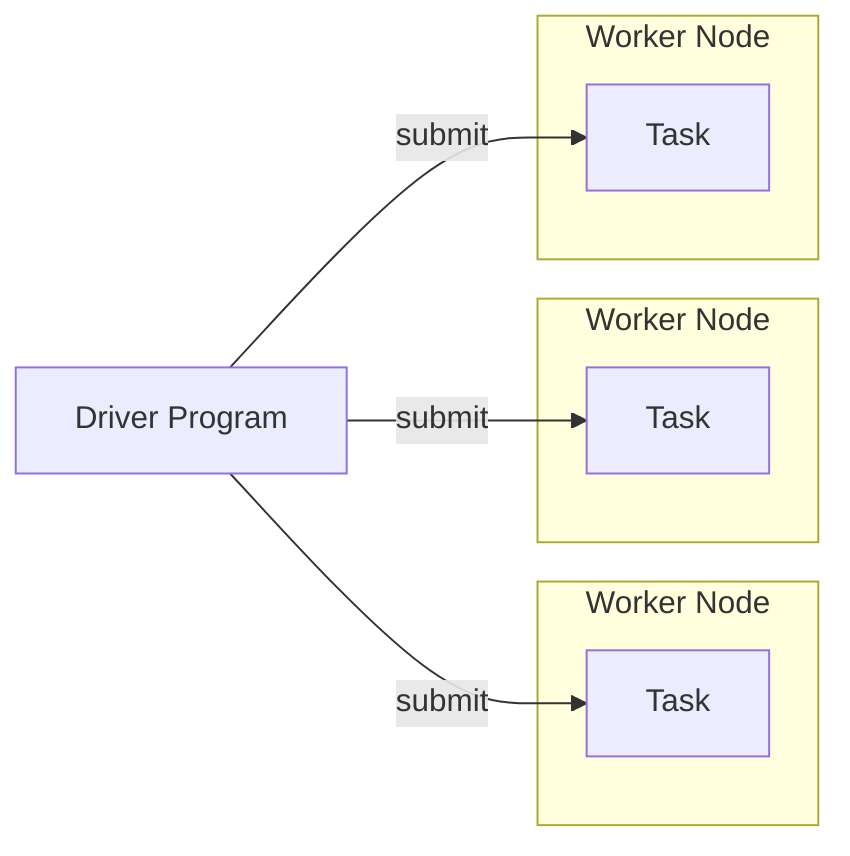

# Experiments with Apache Spark

## Installation

To start using the repository just run

```shell
poetry install
```

## Cheat Sheet

Install Spark:

```shell
poetry add pyspark
```

## The Execution Model

There are two kinds of nodes:

1. a driver program which defines required computation
2. and a worker node executors which actually perform parallel computation

The driver program uses Spark API to describe what computation should be done. This API consists of _transformations_
which basically builds a definition of computational tasks, and _actions_ which actually submit a task to cluster nodes
and return the final result to the driver program.


