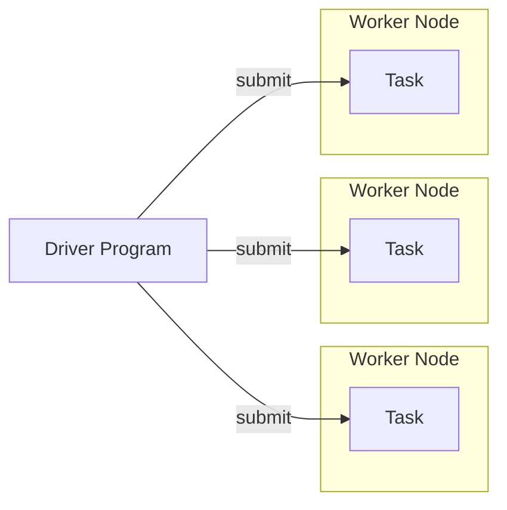

# Experiments with Apache Spark

## Installation

To start using the repository just run

```shell
poetry install
```

## Cheat Sheet

Install Spark:

```shell
poetry add pyspark
```

## The Execution Model

There are two kinds of nodes:

1. a driver program which defines required computation
2. and a worker node executors which actually perform parallel computation

The driver program uses Spark API to describe what computation should be done. This API consists of _transformations_
which basically builds a definition of computational tasks, and _actions_ which actually submit a task to cluster nodes
and return the final result to the driver program.



The main idea is to provide such an API that the driver program may describe the desired computation without knowing any
details of the underlying cluster. The API should be specific enough so that the Spark may figure out how to split the
computation into tasks and how to distribute these tasks across worker nodes, yet flexible enough to describe a broad
range of possible algorithms.

This is exactly the same idea as for
`Tensorflow`, but instead of GPU there is a cluster of executor nodes, instead of Graph and Tensors, there is
a `Dataset`s and `RDD`s.

Spark provides two such API:

1. `RDD`s
2. `Datasets` (a.k.a. `DataFrame`s) from the pyspark.sql module

`Dataset`s are defined using an SQL or Pandas-like API which provide Spark with more information and allows for better
optimization and execution planning.
